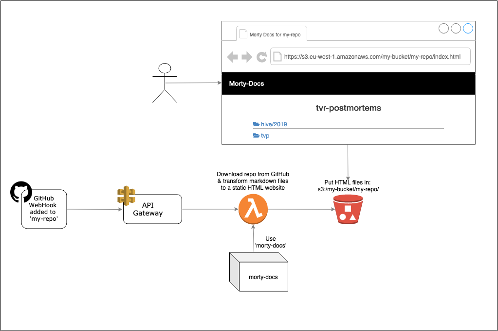

# Morty Docs

[](https://travis-ci.com/bbc/morty-docs)
[](https://codeclimate.com/github/bbc/morty-docs/maintainability)

## Overview

Morty Docs is a library to enable documentation to be generated as a static
website, to allow users to consume the content in an easily accessible format.
It takes an array of markdown and/or asciidoc files and creates a static website.

Morty is specifically aimed at requiring little to no change in the markdown/asciidoc files.

In the BBC we have a large amount of git repositories which often have markdown documentation within them, they don't follow a consistent structure and their content structure can also be wildly different. We wanted a way to publish these with the minimal amount of effort from teams, Morty Docs is what we use to solve this problem.

## Example site made with Morty-Docs

The documentation located [here](https://github.com/bbc/lrud) has been converted to a site using morty-docs, the converted docs can be viewed [here](https://bbc.github.io/morty-docs/).

## Why use Morty Docs over other static site generation?

Use Morty Docs when you already have some markdown/asciidoc files in a directory structure which you want to publish.

Morty Docs was specifically created to publish already existing markdown files without having to change the contents of those files.
It does not use specific directory structures or meta data about the files.
Morty infers the navigation by the directory structure of the files and can be used with no configuration at all.
Plain simple markdown files go in, a html site comes out.

If you do want to be able to have more control over the website which is published and are happy to change your files and structure you might want to pick a more complex static site generator.

## Try it locally

```bash
git clone git@github.com:bbc/morty-docs.git
cd morty-docs
npm ci
npm start # starts local server running Morty Docs
```

Open http://localhost:8080/ in your browser

Morty Docs will generate a website listing an HTML page for each markdown file in the `/default-md-files` directory

To try it with markdown files from a custom directory
```bash
npm start /absolute/path/to/custom/directory
```

## Use as a library

### Install

`npm install --save @bbc/morty-docs`

### Require

```javascript
const { generateTransformInput, transform } = require('@bbc/morty-docs')
```

### Typical use

```javascript
const inputObjs = await generateTransformInput('a/folder/with/markdown-files')

const outputObjs = transform(inputObjs,{ contentTitle: 'My Docs', basePath: '/path/my/docs/are/hosted/under' })
```

- `transform()` can be used alone, but if your files are in a local
directory the `generateTransformInput()` function is a convenience
- the 2nd argument to `transform()` can *optionally* be used to provide a Title
that is displayed on the generated index pages and the base path below which your files will be served (this required to make markdown links starting with `/` work).

- `outputObjs` will be an array of objects like this:

``` javascript
[
  {
    relativePath: 'path/to/file',
    raw: <string> | <Buffer>
  },
  ...
]
```

where value for raw is either generated HTML **or** input that was passed
through because it is not markdown or asciidoc e.g. images

## Things to Consider

### File Ordering

File names are sorted lexically (0-9 < a-z>), meaning that files prefixed with dates will appear at the top of the list. 

If you want your documents to be sorted reverse chronologically, use the date as a prefix to the file name in the format of YYYY-MM-DD - (19-11-2019-some-document).

## Releasing

Releases are versioned through `npm version`, and publishing is handled by our [Travis CI Integration](./.travis.yml)

`$ npm version (major|minor|patch)`

## Example Architecture

Below is an example architecture diagram showing how you could integrate morty-docs with GitHub and AWS S3 to generate static websites for all of an organisation's repositories



## Known issues

We are currently unaware of any issues with morty-docs - if you find an issue
please raise it using our Contribution Guide.

## Why Call it Morty Docs?

Morty Docs originated from an internal project specifically created to publish
our Post Mortem documents which we were writing in Markdown storing in GitHub.
This project was called PostMortemer. We then realised this would be useful for
_any_ Markdown documents! So we made it more generic and called it Morty Docs!

## Contributing

Thanks for wanting to improve the project!

Before contributing back, please familiarise yourself with a few things
we mention below.

### Can I contribute?

Yes.  Contributions are accepted based on the merit of the contribution,
not on the basis of who they are from.

We welcome contributions from everyone.

Please respect each other.

### Adding an issue

If you spot an issue or just want to raise one please use the issue template.

### Contact us!

It's always great to hear from people who are interested and
using morty-docs.

The best way to do this is to open an issue.  Please note, that where a
feature is requested, but we can't add *right now*, will result in us
adding a TODO label to it. We'll come back to it when we can or someone
out there might implement it.

### Incorporating Contributions

We will always accept contributions. We endeavour to ensure that they
fit with the existing code base.

If we alter the contribution we will let you know clearly why. We're
actually more likely to also let you know what we think would be
necessary changes in order to accept your contribution.

Either way, that doesn't stop you using your change nor stop you releasing
your version.  It just means it doesn't fit with the project as we see it
at this time.

### Proposing Changes

Please open an issue.  Then fork the project.  Make your changes in your
clone fork, and create a pull request, referencing the issue. We'll then
discuss the pull request in the issue.

We would expect code quality to be at least as good if not better than
the code quality of the project at the time you make your contribution.
After all, we all hope to leave things better than we find them!

© BBC 2021
